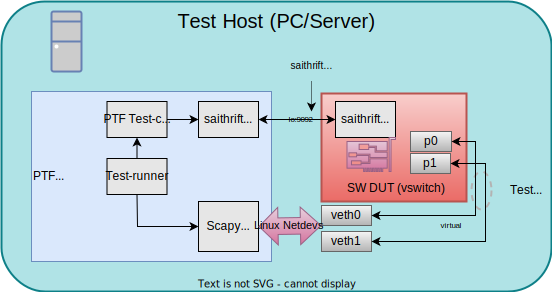
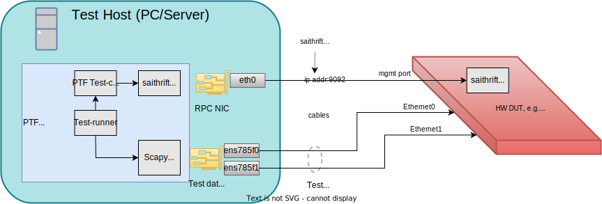

# PTF test user guide

This section describes how to run PTF test cases on your device under test (DUT).

  > This guide covers Ubuntu 18.40 distro and above distros. Steps tested only on Ubuntu 18.04.

`<SAI-URL>` in the documents refers to SAI git repository.

  > **NOTE:** Different SAI branch maps to different SAI header, make sure you use the right version of SAI header.

## Build SAI thrift server and python client (DUT side)

This section describes how to build and install SAI thrift server with python client library for PTF test to run.

### Install prerequisites:

Deb dependencies

```bash
apt update
apt install git python python-pip wget doxygen graphviz aspell
apt install libgetopt-long-descriptive-perl libconst-fast-perl \
libtemplate-perl libnamespace-autoclean-perl libmoose-perl libmoosex-aliases-perl
pip install ctypesgen
```

Apache thrift 0.11.0

- Thrift source packages: http://archive.apache.org/dist/thrift/
- Installation instructions: https://thrift.apache.org/docs/install/
- Debian/Ubuntu install requirements: https://thrift.apache.org/docs/install/debian.html

  > Use: `./configure --prefix=/usr`. The default is to install in `/usr/local*`. Please refer to `./configure --help` for more details.

Example:

```bash
wget http://archive.apache.org/dist/thrift/0.11.0/thrift-0.11.0.tar.gz
tar -xf thrift-0.11.0.tar.gz && cd thrift-0.11.0
apt-get install automake bison flex g++ git libboost-all-dev libevent-dev libssl-dev libtool make pkg-config
./bootstrap.sh && ./configure --prefix=/usr --with-cpp --with-python \
--with-qt4=no --with-qt5=no --with-csharp=no --with-java=no --with-erlang=no \
--with-nodejs=no --with-lua=no --with-per=no --with-php=no --with-dart=no \
--with-ruby=no --with-haskell=no --with-go=no --with-rs=no --with-haxe=no \
--with-dotnetcore=no --with-d=no
make && make install
```

Copy python thrift 0.11.0 library to your Test controller host.

```bash
cd lib/py
python setup.py sdist
# copy: dist/thrift-0.11.0.tar.gz
```

### Generate & build

Clone SAI repository

```bash
mkdir -p workspace && cd workspace
git clone <SAI-URL> && cd SAI
```

Copy headers to `/usr/include/sai`

```bash
mkdir -p /usr/include/sai
cp ./inc/sai*.h /usr/include/sai/
cp ./experimental/*.h /usr/include/sai/
```

  > **NOTE:** if other location is used, the SAI_HEADER_DIR env variable should point to that location.

Install vendor specific SAI library (`libsai.so`) in `/usr/lib`.

  > **NOTE:** refer to vendor SAI library user guide how to install it.

Build SAI thrift server and libraries

```bash
export SAITHRIFTV2=y
make saithrift-build
make saithrift-install
```

  > **NOTE**: commands below is a workaround (WA) and needed until packaging of SAI python is fixed.

Re-generate python SAI thrift library again

```bash
pushd test/saithriftv2
make install-pylib
popd
```

Copy auto-generated python SAI thrift library to your Test controller host.

```bash
# copy test/saithriftv2/dist/saithrift-0.9.tar.gz
```

### Run server

Create sample port config file (or use existing one) for saiserver (number of ports depends on platform)

```bash
cat <<EOF > port-map.ini
# alias lanes
Ethernet1 0,1,2,3
Ethernet2 4,5,6,7
Ethernet3 8,9,10,11
Ethernet4 12,13,14,15
EOF
```

Run server

```bash
saiserver -f port-map.ini
```

## Test controller (client side)

Install PTF dependencies

```bash
apt update
apt install git python3 python3-pip
pip3 install scapy pysubnettree
```

Due to SAI thrift code incompatibility with python 2, python3 needs to be installed as a default

```bash
update-alternatives --install /usr/bin/python python /usr/bin/python3.6 1
update-alternatives --list python
python --version
```

Install thrift-11.0 generated from build SAI server steps

  > **NOTE:** thrift-11.0 can be installed also from scratch as described in `Build SAI thrift server and python client` section.

```bash
tar -xf thrift-0.11.0.tar.gz && cd thrift-0.11.0
python setup.py install
```

Install SAI thrift library generated from build SAI server steps

```bash
tar -xf saithrift-0.9.tar.gz && cd saithrift-0.9
python setup.py install
```

Clone SAI and PTF repositories

```bash
mkdir -p workspace && cd workspace
git clone <SAI-URL> && cd SAI
git submodule update --init test/ptf
```

>**TODO:** Replace following section with per-scenario instructions further ahead.

Create or use existing port map configuration file

```bash
cat <<EOF > /tmp/port-map.ini
# ptf host interface @ switch front port name
0@Ethernet1
1@Ethernet2
2@Ethernet3
3@Ethernet4
EOF
```

Run SAI PTF test cases (RIF in this example)

```bash
./test/ptf/ptf --test-dir ptf --test-params="port_map_file='/tmp/port-map.ini'" --interface 0@veth0 --interface 1@veth2 sairif
```

where, `veth0`, `veth0` and `vethX` are Linux network interfaces (traffic generator port) connected to DUT.
# Test Scenarios
For more details about PTF, see also:
* https://github.com/p4lang/ptf

## Scenario 1: Virtual DUT in Test Host; veth dataplane
This is a common scenario which uses a completely virtual dataplane, for example [P4 behavioral model (bmv2)](https://github.com/p4lang/behavioral-model). Everything runs in pure software on a single host PC or server.

Scapy is used for the dataplane and connects to the SW DUT using virtual Ethernet devices `veth0` and `veth1`. The PTF saithrift client talks to the DUT saithrift server over a local loopback port `lo`.



Typical port-map.ini file:
```
TODO
```
Typical command execution:
```
TODO
```

## Scenario 2: Hardware DUT (NIC, DPU, IPU) in Test Host; cabled dataplane
This scenario depicts a Hardware DUT cabled to a NIC used for test traffic, both in the same physical host chassis. Traffic flows over real connections and the saithrift RPC is over a local loopback port.


Typical port-map.ini file:
```
TODO
```
Typical command execution:
```
TODO
```

## Scenario 3: Network Switch DUT; cabled dataplane; remote RPC

This scenario depicts a standalone network switch as a DUT, cabled to the test Host PC's NIC ports for both test traffic, and control (saithrift) connections.



Typical port-map.ini file:
```
TODO
```
Typical command execution:
```
TODO
```
