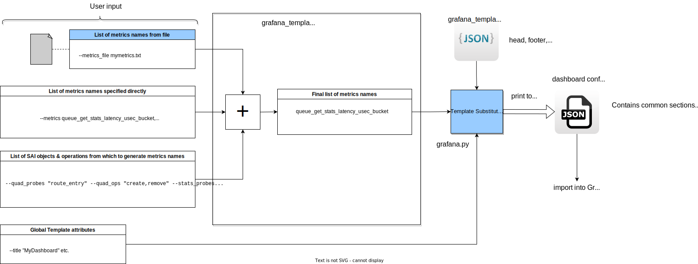
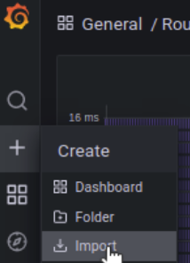
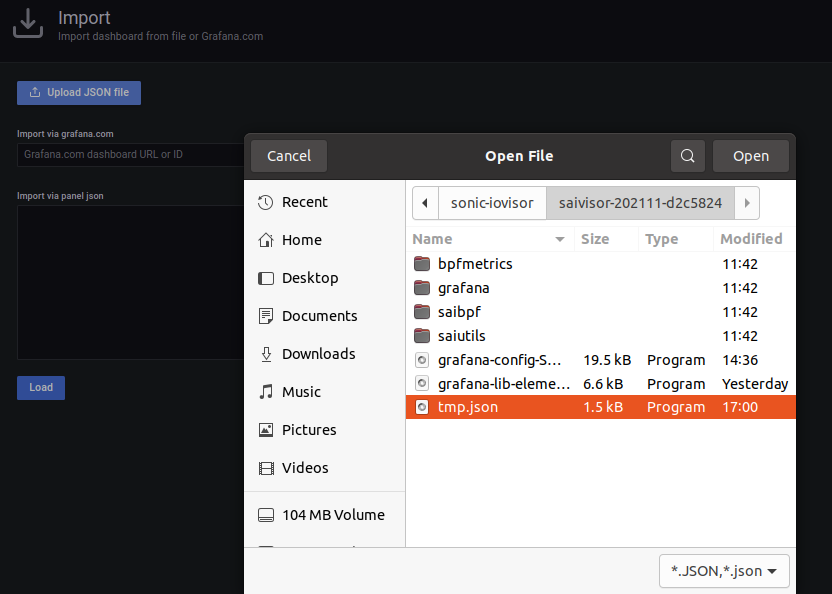
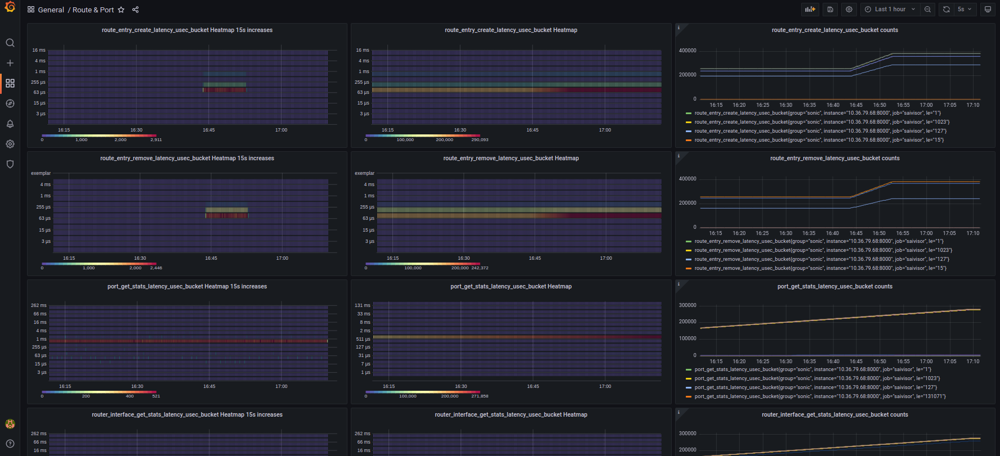
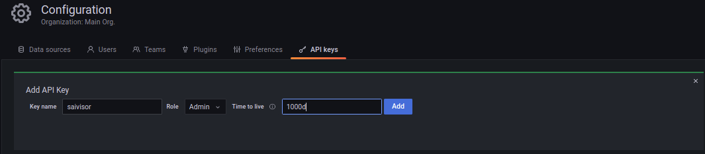
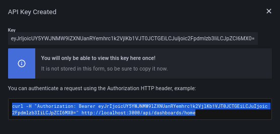
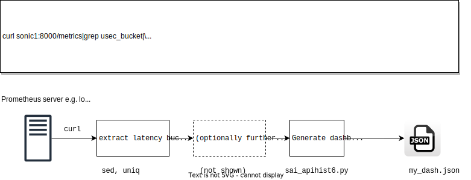

# Grafana Dashboard Generator

## Features
* Generates a dashboard "JSON" file which can be imported into Grafana using either a file upload from browser, or pasted into the Grafana Dashboard import textfield.
* Can specify which panels to generate from either a command line arg, file, stdin or combination.
* Global dashboard attributes e.g. Title, UID, etc.

## TODO/Future enhancements
* Generate "attribute count" panels
* Configure which panels to generate per metric, e.g. bucket counts, heatmap, heatmap increase, or others TBD. Currently all three are emitted.
* Separate the generator code from the BPF probe app, they're two separate things.
* Add ability to query Prometheus server to generate available metrics list & panels directly.
## Design
Currently it's embedded as part of the `sai_api_hist6.py` program since that program already has access to some of the utilities and information about the metrics being monitored. A future version could be standalone, there's not much coupling beween the actual BPF probing, prometheus server etc. and the Grafana generator. Anything common could be put into shared modules.




## Usage
```
$ ./sai_api_hist6.py -h
usage: sai_api_hist6.py [-h] [--output {ascii,json,prometheus,grafana}] [--title TITLE] [--dash_uid DASH_UID] [--metrics METRICS]
                        [--metrics_file METRICS_FILE] [--quad_probes QUAD_PROBES] [--quad_ops QUAD_OPS] [--stats_probes STATS_PROBES]
                        [--stats_ops STATS_OPS] [--datasource_uid DATASOURCE_UID] [--colorScheme COLORSCHEME] [--prom_port PROM_PORT]

Accumulate and print SAI function trace metrics

optional arguments:
  -h, --help            show this help message and exit
  --output {ascii,json,prometheus,grafana}
                        Metrics output format. ascii, json send probe info to console; prometheus exposes /metrics HTTP server; grafana emits dashboard .json only
  --title TITLE         Dashboard Title, e.g. SAI Visor"
  --dash_uid DASH_UID   Dashboard UID, e.g. "2"; needed when you import into Grafana to keep unique
  --metrics METRICS     comma-separated list of metrics to add to Grafana dashboard when using "--output grafana" option, e.g. "route_entry_create_latency_usec_bucket,route_entry_remove_latency_usec_bucket"; if omitted, probes are read from ELF file
  --metrics_file METRICS_FILE
                        comma-separated and/or line-separated list of metrics to add to Grafana dashboard when using "--output grafana" option, use "-" for stdin
  --quad_probes QUAD_PROBES
                        comma-separated list of SAI quad entry objects to add to Grafana dashboard when using "--output grafana" option, e.g. "route_entry,neighbor"; if omitted, probes are read from ELF file
  --quad_ops QUAD_OPS   comma-separated list of SAI quad entry operations to add to Grafana dashboard when using "--output grafana" option, e.g. "create,remove"; if omitted, all operations are included
  --stats_probes STATS_PROBES
                        comma-separated list of SAI stats objects to add to Grafana dashboard when using "--output grafana" option, e.g. "port,router_interface"; if omitted, probes are read from ELF file
  --stats_ops STATS_OPS
                        comma-separated list of SAI stats operations to add to Grafana dashboard when using "--output grafana" option, e.g. "get,clear"; if omitted, all operations are included
  --datasource_uid DATASOURCE_UID
                        Grafana datasource UID, e.g. "1"
  --colorScheme COLORSCHEME
                        Grafana heatmap colorscheme, e.g. "interpolateSpectral"
  --prom_port PROM_PORT
                        Server port for prometheus metrics [8000]

Examples:
=========
Install BPF probes and continuously expose live Prometheus metrics:
./sai_api_hist6.py --output prometheus [--prom_port 8000]

Install BPF probes and accumulate histograms, output as ASCII-art after terminating via ^C:
./sai_api_hist6.py --output ascii

Install BPF probes and accumulate histograms, output as JSON data after terminating via ^C:
./sai_api_hist6.py --output json

Gafana dashboard JSON generation. The following cmd-line operations control which metrics to generate panels for, and their effect is cumulative, i.e. you can specify metrics from multiple sources and their names will be added to a list from which to genreate panels:
--quad_probes, --quad_ops, --stats_probes, --stats_ops, --metrics, --metrics_file

Generate Grafana dashboard JSON for specified SAI objects and operations, plus stats objects and operations:
./sai_api_hist6.py --output grafana --quad_probes "route_entry" --quad_ops "create,remove" --stats_probes "port,router_interface" --stats_ops "get_stats" --datasource_uid vf50YxP7z --title "Route & Port" --dash_uid 2

Generate Grafana dashboard JSON for metrics passed in as --metrics argument:
./sai_api_hist6.py --output grafana --metrics "route_entry_create_latency_usec_bucket,route_entry_remove_latency_usec_bucket" --datasource_uid vf50YxP7z --title "Route & Port3" --dash_uid 3

Generate Grafana dashboard JSON for metrics read from file "tmp":
./sai_api_hist6.py --output grafana --metrics_file tmp --datasource_uid vf50YxP7z --title "Route & Port5" --dash_uid 5

Generate Grafana dashboard JSON for metrics read from stdin:
echo 'route_entry_create_latency_usec_bucket,route_entry_remove_latency_usec_bucket' | ./sai_api_hist6.py --output grafana --metrics_file - --datasource_uid vf50YxP7z --title "Route & Port5" --dash_uid 5
```
## Example - Generate panel with specified list of SAI objects & operations to display
The following generates Grafana dashboard to display route_entry create/remove latencies and port/router_interface stats latencies. The `--quad_probes <> --quad_ops <> --stats_probes<> --stats_ops <>` comand-line arguments specify which sets of panels to generate.

### Generate
```
chris@chris-z4:~/sonic-sandbox/sonic-iovisor/saivisor-202111-d2c5824$ ./sai_api_hist6.py --output grafana --quad_probes "route_entry" --quad_ops "create,remove" --stats_probes "port,router_interface" --stats_ops "get_stats" --datasource_uid vf50YxP7z --title "Route & Port" --dash_uid 2 >tmp.json
```
Output:
```
Generating Grafana dashboard header...
[2022-03-24 16:56:23,479] [    INFO] grafana.emit_dashboard_header-12: Generating Grafana dashboard header...
Generating Grafana dashboard panels...
[2022-03-24 16:56:23,479] [    INFO] grafana.emit_dashboard_panels-53: Generating Grafana dashboard panels...
  Generating Grafana panels for route_entry_create
[2022-03-24 16:56:23,479] [    INFO] grafana.generate_panel_set-36:   Generating Grafana panels for route_entry_create
  Generating Grafana panels for route_entry_remove
[2022-03-24 16:56:23,479] [    INFO] grafana.generate_panel_set-36:   Generating Grafana panels for route_entry_remove
  Generating Grafana panels for port_get_stats
[2022-03-24 16:56:23,479] [    INFO] grafana.generate_panel_set-36:   Generating Grafana panels for port_get_stats
  Generating Grafana panels for router_interface_get_stats
[2022-03-24 16:56:23,479] [    INFO] grafana.generate_panel_set-36:   Generating Grafana panels for router_interface_get_stats
Generated 12 panels total
[2022-03-24 16:56:23,479] [    INFO] grafana.emit_dashboard_panels-75: Generated 12 panels total
Generating Grafana dashboard footer...
[2022-03-24 16:56:23,479] [    INFO] grafana.emit_dashboard_footer-16: Generating Grafana dashboard footer...
```
### Manually Import dashboard spec file into Grafana
* Click on "+" menu item in left pane, select "Import" to import a dashboard JSON spec.



* Click the "Upload JSON File" button and use the file chooser to select a file, or paste JSON into the text box


* Follow any other instructiins, e.g. override the Dashboard's "ID."
### Resulting Dashboard


### POST a dashboard spec file via Grafana API
This technique uses an HTTP client to push a JSON file into Grafana via its API saerver endopint. It is an alternative to manually importing.

Use the Grafana web GUI to create an API key. See figure below:



View and copy the key to the clipboard, this is a one-time option. For this example, the key is `eyJrIjoicUY5YWJNMW9lZXNUanRYemhrc1k2VjlKb1VJT0JCTGEiLCJuIjoic2Fpdmlzb3IiLCJpZCI6MX0=`. See figure below:



This key will be used in API requests to the Grafana server.
## Example - Glean available stats from metrics endpoint and use to generate panels
Read the prometheus metrics server and filter output to get a list of latency histogram metrics (all those with `usec_bucket`). Use `sed` to print just the metric name ending in` usec_bucket` and use `uniq` to remove duplicates (collapse all the labeled buckets into one "bucket" metric name).

Note the names printed follow the `curl` fetch progress stats. The  progress messages appear on `stderr` and the output of interest appears on `stdout`, making it convenient to pass in a pipeline or into a file.
```
curl sonic1:8000/metrics|grep usec_bucket|sed -s 's/\(.*usec_bucket\).*/\1/'|uniq
  % Total    % Received % Xferd  Average Speed   Time    Time     Time  Current
                                 Dload  Upload   Total   Spent    Left  Speed
100 17022  100 17022    0     0  44443      0 --:--:-- --:--:-- --:--:-- 44443
queue_get_stats_latency_usec_bucket
route_entry_create_latency_usec_bucket
port_get_stats_latency_usec_bucket
route_entry_remove_latency_usec_bucket
ingress_priority_group_get_stats_latency_usec_bucket
router_interface_get_stats_latency_usec_bucket
ingress_priority_group_clear_stats_latency_usec_bucket
queue_clear_stats_latency_usec_bucket
```

We'll show several ways to generate the Grafana config JSON.

### Read `metrics/`, filter and pipe to generator directly
This techniques gets the available metrics from a live running Prometheus endpoint which is collecting BPF probe histograms. Only BPF maps which have been populated will appear because only those result in metrics output from the server.

```
curl sonic1:8000/metrics|grep usec_bucket|sed -s 's/\(.*usec_bucket\).*/\1/' |uniq|./sai_api_hist6.py --output grafana --metrics_file - --datasource_uid vf50YxP7z --title "Available Metrics" --dash_uid 6 > my_dash.json
```

Figure below illustrates this technique.



### Read `metrics/`, filter into a file; then send to generator as file argument
Reuse the command to read metrics from Prometheus, send filtered result into a file for reuse:
```
4$ curl sonic1:8000/metrics|grep usec_bucket|sed -s 's/\(.*usec_bucket\).*/\1/
'|uniq>tmp.txt
  % Total    % Received % Xferd  Average Speed   Time    Time     Time  Current
                                 Dload  Upload   Total   Spent    Left  Speed
100 17009  100 17009    0     0  38481      0 --:--:-- --:--:-- --:--:-- 38481
```
Look at file contents - it's a list of metrics names:
```
chris@chris-z4:~/sonic-sandbox/sonic-iovisor/saivisor-202111-d2c5824$ cat tmp.txt 
queue_get_stats_latency_usec_bucket
route_entry_create_latency_usec_bucket
port_get_stats_latency_usec_bucket
route_entry_remove_latency_usec_bucket
ingress_priority_group_get_stats_latency_usec_bucket
router_interface_get_stats_latency_usec_bucket
ingress_priority_group_clear_stats_latency_usec_bucket
queue_clear_stats_latency_usec_bucket
```

Send this list of metrics names as input to the generator three different ways.

As a filename:
```
./sai_api_hist6.py --output grafana --metrics_file tmp.txt --datasource_uid vf50YxP7z --title "Available Metrics" --dash_uid 6 > my_dash.json
```

As standard input, using redirect operator:
```
./sai_api_hist6.py --output grafana --metrics_file - --datasource_uid vf50YxP7z --title "Available Metrics" --dash_uid 6 > my_dash.json < tmp.txt
```
As standard input, using pipe:
```
cat tmp.txt | ./sai_api_hist6.py --output grafana --metrics_file - --datasource_uid vf50YxP7z --title "Available Metrics" --dash_uid 6 > my_dash.json
```