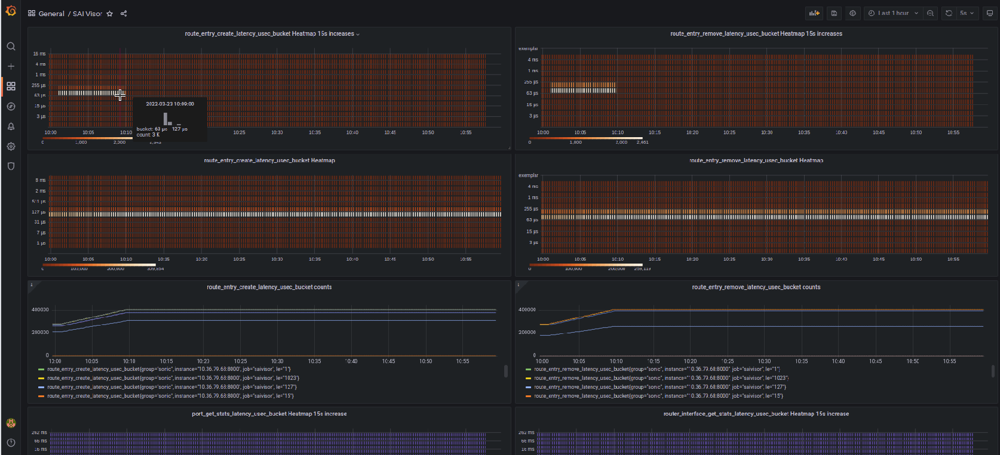
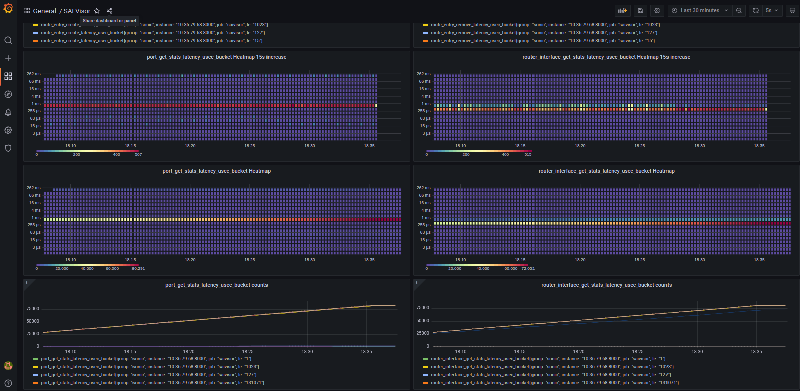
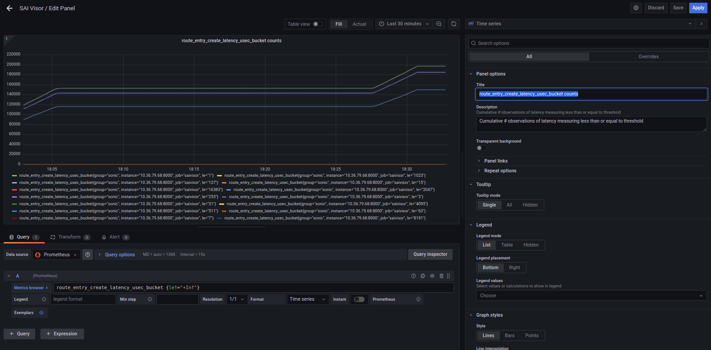
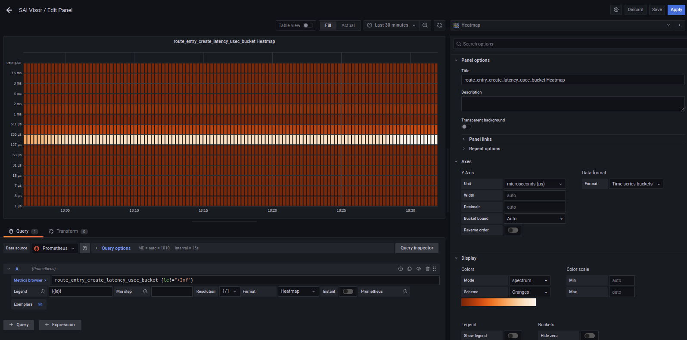
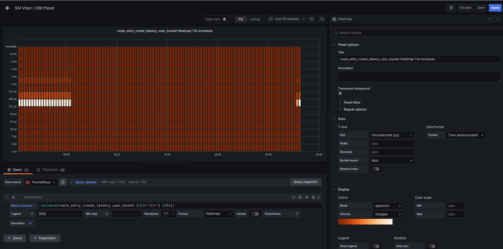
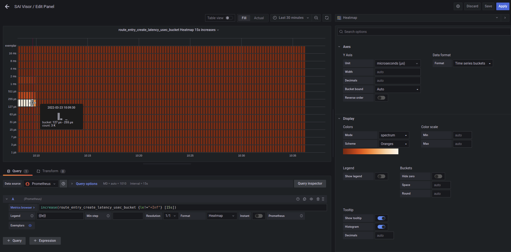

# sai_api_hist6.py tracing program with Prometheus Metrics Exporter
This enables USDT probes around SAI route entry funcs. The probes measure latency between the func entry and exit probes, accumulate log2 histograms in multi-indexed (by SAI obj type and operation) BPF histogram maps  and prints them out. It mainly probes the so-called QUAD accessors wihch are usd in `syncd.cpp` plus the get/clear stats functions. Empirically, `tplist-bpfcc` shows mainly `xxx_entry` SAI objects. I need to find out where to instrument other object types such as ports.

The changes compared to [../saivisor-202111-cc46936/sai_api_hist5.py](../saivisor-202111-cc46936/sai_api_hist5.py) is to add a prometheus metrics exporter on port 8000.

 See also: [Grafana Dashboard Generator](README-grafana-dashboards.md) which `sai_api_hist6.py` implements, with helper libs.

# References
* https://prometheus.io/docs/practices/histograms/
* https://github.com/OpenObservability/OpenMetrics/blob/main/specification/OpenMetrics.md#histogram
* https://grafana.com/docs/grafana/latest/administration/configure-docker/
* https://grafana.com/docs/grafana/latest/basics/intro-histograms/
* https://www.youtube.com/watch?v=6oSlgW6EKK4 - "Grafana Prometheus with Heat Maps | Grafana Heatmap Histograms"
* https://grafana.com/docs/grafana/latest/visualizations/histogram/
* https://grafana.com/docs/grafana/latest/visualizations/heatmap/
* https://www.robustperception.io/how-does-a-prometheus-histogram-work
* https://vbehar.medium.com/using-prometheus-exemplars-to-jump-from-metrics-to-traces-in-grafana-249e721d4192

# Diagram

## TODO - next steps
* Add SAI attr APIs
* Where are port APIs etc.?
* Fix grafana dashboard generation from running BPF (actual maps)
* Filter ops from -- options
* Pass dictionary of template params around, reduce function arg lists (extend dict as it descends).


# Install Prerequisites
On target device (e.g. SONiC whitebox switch):
```
pip install prometheus_client
```
or
```
pip install -r requirements.txt
```

# Example
Summary:
* Start program - it waits for CTRL-C to stop and print
* Run `route_cmds.sh` to add/delete 255 routes on SONiC box
* Stop program, view histograms

## Start tracing program
```
root@sonic:/home/chris# ./sai_api_hist6.py --prometheus

Skipping probes for port
Skipping probes for lag
Skipping probes for virtual_router
Skipping probes for next_hop
Skipping probes for next_hop_group
Skipping probes for router_interface
Skipping probes for acl_table
Skipping probes for acl_counter
Skipping probes for acl_range
Skipping probes for acl_table_group
Skipping probes for acl_table_group_member
Skipping probes for hostif
Skipping probes for mirror_session
Skipping probes for sample_packet
Skipping probes for stp
Skipping probes for hostif_trap_group
Skipping probes for policer
Skipping probes for wred
Skipping probes for qos_map
Skipping probes for queue
Skipping probes for scheduler
Skipping probes for scheduler_group
Skipping probes for buffer_pool
Skipping probes for buffer_profile
Skipping probes for ingress_priority_group
Skipping probes for lag_member
Skipping probes for hash
Skipping probes for udf
Skipping probes for udf_match
Skipping probes for udf_group
==> Enabling QUAD (create,remove,set,get) func & ret USDT probes for SAI object:fdb_entry (8 total)
Skipping probes for switch
Skipping probes for hostif_trap
==> Enabling QUAD (create,remove,set,get) func & ret USDT probes for SAI object:neighbor_entry (8 total)
==> Enabling QUAD (create,remove,set,get) func & ret USDT probes for SAI object:route_entry (8 total)
Skipping probes for vlan
Skipping probes for vlan_member
Skipping probes for hostif_packet
Skipping probes for tunnel_map
Skipping probes for tunnel
Skipping probes for fdb_flush
Skipping probes for next_hop_group_member
Skipping probes for stp_port
Skipping probes for rpf_group
Skipping probes for rpf_group_member
Skipping probes for l2mc_group
Skipping probes for l2mc_group_member
Skipping probes for ipmc_group
Skipping probes for ipmc_group_member
==> Enabling QUAD (create,remove,set,get) func & ret USDT probes for SAI object:l2mc_entry (8 total)
==> Enabling QUAD (create,remove,set,get) func & ret USDT probes for SAI object:ipmc_entry (8 total)
==> Enabling QUAD (create,remove,set,get) func & ret USDT probes for SAI object:mcast_fdb_entry (8 total)
Skipping probes for hostif_user_defined_trap
Skipping probes for bridge
Skipping probes for bridge_port
Skipping probes for tam
Skipping probes for srv6_sidlist
Skipping probes for port_pool
==> Enabling QUAD (create,remove,set,get) func & ret USDT probes for SAI object:inseg_entry (8 total)
Skipping probes for dtel
Skipping probes for dtel_queue_report
Skipping probes for dtel_int_session
Skipping probes for dtel_report_session
Skipping probes for dtel_event
Skipping probes for bfd_session
Skipping probes for isolation_group
Skipping probes for isolation_group_member
Skipping probes for tam_math_func
Skipping probes for tam_report
Skipping probes for tam_event_threshold
Skipping probes for tam_tel_type
Skipping probes for tam_transport
Skipping probes for tam_telemetry
Skipping probes for tam_collector
Skipping probes for tam_event_action
Skipping probes for tam_event
Skipping probes for nat_zone_counter
==> Enabling QUAD (create,remove,set,get) func & ret USDT probes for SAI object:nat_entry (8 total)
Skipping probes for tam_int
Skipping probes for counter
Skipping probes for debug_counter
Skipping probes for port_connector
Skipping probes for port_serdes
Skipping probes for macsec
Skipping probes for macsec_port
Skipping probes for macsec_flow
Skipping probes for macsec_sc
Skipping probes for macsec_sa
Skipping probes for system_port
Skipping probes for fine_grained_hash_field
Skipping probes for switch_tunnel
==> Enabling QUAD (create,remove,set,get) func & ret USDT probes for SAI object:my_sid_entry (8 total)
Skipping probes for my_mac
Skipping probes for next_hop_group_map
Skipping probes for ipsec
Skipping probes for ipsec_port
Skipping probes for ipsec_sa
==> Enabling func & ret USDT probes for sai_get_stats() (2 probes total)
==> Enabling func & ret USDT probes for sai_get_stats_ext() (2 probes total)
==> Enabling func & ret USDT probes for sai_clear_stats() (2 probes total)
...

Starting Prometheus server on port :8000/metrics
Tracing SAI functions... Hit Ctrl-C to end.
```

>**NOTE**: Kill with ^C to end experiment

```
^C...Shutting down Prometheus server
...                                       |
```
## Add/Delete routes
```
root@sonic:/home/chris# ./route_cmds.sh 
ip r add 31.1.8.1/32 dev Ethernet8
ip r add 31.1.8.2/32 dev Ethernet8
ip r add 31.1.8.3/32 dev Ethernet8
...
ip r del 31.1.1.253/32 dev Ethernet8
ip r del 31.1.1.254/32 dev Ethernet8
ip r del 31.1.1.255/32 dev Ethernet8
```

Or, for more activity:
```
for i in {1..500};do ./route_cmds.sh;done
```

## Fetch metrics
Browse or use `curl` to get metrics:
```
chris@chris-z4:~/sonic-sandbox/sonic-iovisor$ curl http://sonic1:8000/metrics

# HELP python_gc_objects_collected_total Objects collected during gc
# TYPE python_gc_objects_collected_total counter
python_gc_objects_collected_total{generation="0"} 123.0
python_gc_objects_collected_total{generation="1"} 273.0
python_gc_objects_collected_total{generation="2"} 0.0
# HELP python_gc_objects_uncollectable_total Uncollectable object found during GC
# TYPE python_gc_objects_uncollectable_total counter
python_gc_objects_uncollectable_total{generation="0"} 0.0
python_gc_objects_uncollectable_total{generation="1"} 0.0
python_gc_objects_uncollectable_total{generation="2"} 0.0
# HELP python_gc_collections_total Number of times this generation was collected
# TYPE python_gc_collections_total counter
python_gc_collections_total{generation="0"} 48.0
python_gc_collections_total{generation="1"} 4.0
python_gc_collections_total{generation="2"} 0.0
# HELP python_info Python platform information
# TYPE python_info gauge
python_info{implementation="CPython",major="3",minor="9",patchlevel="2",version="3.9.2"} 1.0
# HELP process_virtual_memory_bytes Virtual memory size in bytes.
# TYPE process_virtual_memory_bytes gauge
process_virtual_memory_bytes 3.68513024e+08
# HELP process_resident_memory_bytes Resident memory size in bytes.
# TYPE process_resident_memory_bytes gauge
process_resident_memory_bytes 1.20905728e+08
# HELP process_start_time_seconds Start time of the process since unix epoch in seconds.
# TYPE process_start_time_seconds gauge
process_start_time_seconds 1.64799676632e+09
# HELP process_cpu_seconds_total Total user and system CPU time spent in seconds.
# TYPE process_cpu_seconds_total counter
process_cpu_seconds_total 8.37
# HELP process_open_fds Number of open file descriptors.
# TYPE process_open_fds gauge
process_open_fds 166.0
# HELP process_max_fds Maximum number of open file descriptors.
# TYPE process_max_fds gauge
process_max_fds 1024.0
# HELP ingress_priority_group_get_stats_latency_usec ingress_priority_group_get_stats_latency
# TYPE ingress_priority_group_get_stats_latency_usec histogram
ingress_priority_group_get_stats_latency_usec_bucket{le="1"} 0.0 1647999902908
ingress_priority_group_get_stats_latency_usec_bucket{le="3"} 0.0 1647999902908
ingress_priority_group_get_stats_latency_usec_bucket{le="7"} 0.0 1647999902908
ingress_priority_group_get_stats_latency_usec_bucket{le="15"} 0.0 1647999902908
ingress_priority_group_get_stats_latency_usec_bucket{le="31"} 0.0 1647999902908
ingress_priority_group_get_stats_latency_usec_bucket{le="63"} 1371.0 1647999902908
ingress_priority_group_get_stats_latency_usec_bucket{le="127"} 79266.0 1647999902908
ingress_priority_group_get_stats_latency_usec_bucket{le="255"} 79785.0 1647999902908
ingress_priority_group_get_stats_latency_usec_bucket{le="511"} 80093.0 1647999902908
ingress_priority_group_get_stats_latency_usec_bucket{le="1023"} 80123.0 1647999902908
ingress_priority_group_get_stats_latency_usec_bucket{le="2047"} 92686.0 1647999902908
ingress_priority_group_get_stats_latency_usec_bucket{le="4095"} 93376.0 1647999902908
ingress_priority_group_get_stats_latency_usec_bucket{le="8191"} 93440.0 1647999902908
ingress_priority_group_get_stats_latency_usec_bucket{le="+Inf"} 93440.0 1647999902908
ingress_priority_group_get_stats_latency_usec_count 93440.0 1647999902908
ingress_priority_group_get_stats_latency_usec_sum 3.9459136e+07 1647999902908
# HELP queue_clear_stats_latency_usec queue_clear_stats_latency
# TYPE queue_clear_stats_latency_usec histogram
queue_clear_stats_latency_usec_bucket{le="1"} 0.0 1647999902908
queue_clear_stats_latency_usec_bucket{le="3"} 0.0 1647999902908
queue_clear_stats_latency_usec_bucket{le="7"} 0.0 1647999902908
queue_clear_stats_latency_usec_bucket{le="15"} 0.0 1647999902908
queue_clear_stats_latency_usec_bucket{le="31"} 0.0 1647999902908
queue_clear_stats_latency_usec_bucket{le="63"} 30949.0 1647999902908
queue_clear_stats_latency_usec_bucket{le="127"} 32997.0 1647999902908
queue_clear_stats_latency_usec_bucket{le="255"} 33198.0 1647999902908
queue_clear_stats_latency_usec_bucket{le="511"} 33252.0 1647999902908
queue_clear_stats_latency_usec_bucket{le="1023"} 33267.0 1647999902908
queue_clear_stats_latency_usec_bucket{le="2047"} 33277.0 1647999902908
queue_clear_stats_latency_usec_bucket{le="4095"} 33280.0 1647999902908
queue_clear_stats_latency_usec_bucket{le="+Inf"} 33280.0 1647999902908
queue_clear_stats_latency_usec_count 33280.0 1647999902908
queue_clear_stats_latency_usec_sum 2.370112e+06 1647999902908
# HELP router_interface_get_stats_latency_usec router_interface_get_stats_latency
# TYPE router_interface_get_stats_latency_usec histogram
router_interface_get_stats_latency_usec_bucket{le="1"} 0.0 1647999902909
router_interface_get_stats_latency_usec_bucket{le="3"} 0.0 1647999902909
router_interface_get_stats_latency_usec_bucket{le="7"} 0.0 1647999902909
router_interface_get_stats_latency_usec_bucket{le="15"} 0.0 1647999902909
router_interface_get_stats_latency_usec_bucket{le="31"} 0.0 1647999902909
router_interface_get_stats_latency_usec_bucket{le="63"} 0.0 1647999902909
router_interface_get_stats_latency_usec_bucket{le="127"} 0.0 1647999902909
router_interface_get_stats_latency_usec_bucket{le="255"} 0.0 1647999902909
router_interface_get_stats_latency_usec_bucket{le="511"} 87295.0 1647999902909
router_interface_get_stats_latency_usec_bucket{le="1023"} 99711.0 1647999902909
router_interface_get_stats_latency_usec_bucket{le="2047"} 100064.0 1647999902909
router_interface_get_stats_latency_usec_bucket{le="4095"} 100094.0 1647999902909
router_interface_get_stats_latency_usec_bucket{le="8191"} 100104.0 1647999902909
router_interface_get_stats_latency_usec_bucket{le="16383"} 100119.0 1647999902909
router_interface_get_stats_latency_usec_bucket{le="32767"} 100148.0 1647999902909
router_interface_get_stats_latency_usec_bucket{le="65535"} 100155.0 1647999902909
router_interface_get_stats_latency_usec_bucket{le="131071"} 100188.0 1647999902909
router_interface_get_stats_latency_usec_bucket{le="262143"} 100256.0 1647999902909
router_interface_get_stats_latency_usec_bucket{le="+Inf"} 100256.0 1647999902909
router_interface_get_stats_latency_usec_count 100256.0 1647999902909
router_interface_get_stats_latency_usec_sum 8.214272e+07 1647999902909
# HELP queue_get_stats_latency_usec queue_get_stats_latency
# TYPE queue_get_stats_latency_usec histogram
queue_get_stats_latency_usec_bucket{le="1"} 0.0 1647999902909
queue_get_stats_latency_usec_bucket{le="3"} 0.0 1647999902909
queue_get_stats_latency_usec_bucket{le="7"} 0.0 1647999902909
queue_get_stats_latency_usec_bucket{le="15"} 30910.0 1647999902909
queue_get_stats_latency_usec_bucket{le="31"} 145792.0 1647999902909
queue_get_stats_latency_usec_bucket{le="63"} 197738.0 1647999902909
queue_get_stats_latency_usec_bucket{le="127"} 200153.0 1647999902909
queue_get_stats_latency_usec_bucket{le="255"} 200203.0 1647999902909
queue_get_stats_latency_usec_bucket{le="511"} 200225.0 1647999902909
queue_get_stats_latency_usec_bucket{le="1023"} 218606.0 1647999902909
queue_get_stats_latency_usec_bucket{le="2047"} 233330.0 1647999902909
queue_get_stats_latency_usec_bucket{le="4095"} 233395.0 1647999902909
queue_get_stats_latency_usec_bucket{le="8191"} 233525.0 1647999902909
queue_get_stats_latency_usec_bucket{le="16383"} 233541.0 1647999902909
queue_get_stats_latency_usec_bucket{le="32767"} 233554.0 1647999902909
queue_get_stats_latency_usec_bucket{le="65535"} 233575.0 1647999902909
queue_get_stats_latency_usec_bucket{le="131071"} 233599.0 1647999902909
queue_get_stats_latency_usec_bucket{le="262143"} 233600.0 1647999902909
queue_get_stats_latency_usec_bucket{le="+Inf"} 233600.0 1647999902909
queue_get_stats_latency_usec_count 233600.0 1647999902909
queue_get_stats_latency_usec_sum 6.3608864e+07 1647999902909
# HELP route_entry_remove_latency_usec route_entry_remove_latency
# TYPE route_entry_remove_latency_usec histogram
route_entry_remove_latency_usec_bucket{le="1"} 0.0 1647999902909
route_entry_remove_latency_usec_bucket{le="3"} 0.0 1647999902909
route_entry_remove_latency_usec_bucket{le="7"} 0.0 1647999902909
route_entry_remove_latency_usec_bucket{le="15"} 0.0 1647999902909
route_entry_remove_latency_usec_bucket{le="31"} 0.0 1647999902909
route_entry_remove_latency_usec_bucket{le="63"} 0.0 1647999902909
route_entry_remove_latency_usec_bucket{le="127"} 177820.0 1647999902909
route_entry_remove_latency_usec_bucket{le="255"} 271174.0 1647999902909
route_entry_remove_latency_usec_bucket{le="511"} 279538.0 1647999902909
route_entry_remove_latency_usec_bucket{le="1023"} 279978.0 1647999902909
route_entry_remove_latency_usec_bucket{le="2047"} 280322.0 1647999902909
route_entry_remove_latency_usec_bucket{le="4095"} 280403.0 1647999902909
route_entry_remove_latency_usec_bucket{le="8191"} 280408.0 1647999902909
route_entry_remove_latency_usec_bucket{le="+Inf"} 280408.0 1647999902909
route_entry_remove_latency_usec_count 280408.0 1647999902909
route_entry_remove_latency_usec_sum 5.246976e+07 1647999902909
# HELP port_get_stats_latency_usec port_get_stats_latency
# TYPE port_get_stats_latency_usec histogram
port_get_stats_latency_usec_bucket{le="1"} 0.0 1647999902910
port_get_stats_latency_usec_bucket{le="3"} 0.0 1647999902910
port_get_stats_latency_usec_bucket{le="7"} 0.0 1647999902910
port_get_stats_latency_usec_bucket{le="15"} 0.0 1647999902910
port_get_stats_latency_usec_bucket{le="31"} 578.0 1647999902910
port_get_stats_latency_usec_bucket{le="63"} 1335.0 1647999902910
port_get_stats_latency_usec_bucket{le="127"} 1577.0 1647999902910
port_get_stats_latency_usec_bucket{le="255"} 1653.0 1647999902910
port_get_stats_latency_usec_bucket{le="511"} 1664.0 1647999902910
port_get_stats_latency_usec_bucket{le="1023"} 100161.0 1647999902910
port_get_stats_latency_usec_bucket{le="2047"} 101049.0 1647999902910
port_get_stats_latency_usec_bucket{le="4095"} 101445.0 1647999902910
port_get_stats_latency_usec_bucket{le="8191"} 101492.0 1647999902910
port_get_stats_latency_usec_bucket{le="16383"} 101550.0 1647999902910
port_get_stats_latency_usec_bucket{le="32767"} 101657.0 1647999902910
port_get_stats_latency_usec_bucket{le="65535"} 101747.0 1647999902910
port_get_stats_latency_usec_bucket{le="131071"} 101917.0 1647999902910
port_get_stats_latency_usec_bucket{le="262143"} 101920.0 1647999902910
port_get_stats_latency_usec_bucket{le="+Inf"} 101920.0 1647999902910
port_get_stats_latency_usec_count 101920.0 1647999902910
port_get_stats_latency_usec_sum 1.3823296e+08 1647999902910
# HELP ingress_priority_group_clear_stats_latency_usec ingress_priority_group_clear_stats_latency
# TYPE ingress_priority_group_clear_stats_latency_usec histogram
ingress_priority_group_clear_stats_latency_usec_bucket{le="1"} 0.0 1647999902910
ingress_priority_group_clear_stats_latency_usec_bucket{le="3"} 0.0 1647999902910
ingress_priority_group_clear_stats_latency_usec_bucket{le="7"} 0.0 1647999902910
ingress_priority_group_clear_stats_latency_usec_bucket{le="15"} 0.0 1647999902910
ingress_priority_group_clear_stats_latency_usec_bucket{le="31"} 0.0 1647999902910
ingress_priority_group_clear_stats_latency_usec_bucket{le="63"} 0.0 1647999902910
ingress_priority_group_clear_stats_latency_usec_bucket{le="127"} 12846.0 1647999902910
ingress_priority_group_clear_stats_latency_usec_bucket{le="255"} 13167.0 1647999902910
ingress_priority_group_clear_stats_latency_usec_bucket{le="511"} 13262.0 1647999902910
ingress_priority_group_clear_stats_latency_usec_bucket{le="1023"} 13297.0 1647999902910
ingress_priority_group_clear_stats_latency_usec_bucket{le="2047"} 13305.0 1647999902910
ingress_priority_group_clear_stats_latency_usec_bucket{le="4095"} 13311.0 1647999902910
ingress_priority_group_clear_stats_latency_usec_bucket{le="8191"} 13312.0 1647999902910
ingress_priority_group_clear_stats_latency_usec_bucket{le="+Inf"} 13312.0 1647999902910
ingress_priority_group_clear_stats_latency_usec_count 13312.0 1647999902910
ingress_priority_group_clear_stats_latency_usec_sum 1.860096e+06 1647999902910
# HELP route_entry_create_latency_usec route_entry_create_latency
# TYPE route_entry_create_latency_usec histogram
route_entry_create_latency_usec_bucket{le="1"} 0.0 1647999902910
route_entry_create_latency_usec_bucket{le="3"} 0.0 1647999902910
route_entry_create_latency_usec_bucket{le="7"} 0.0 1647999902910
route_entry_create_latency_usec_bucket{le="15"} 0.0 1647999902910
route_entry_create_latency_usec_bucket{le="31"} 0.0 1647999902910
route_entry_create_latency_usec_bucket{le="63"} 2.0 1647999902910
route_entry_create_latency_usec_bucket{le="127"} 213054.0 1647999902910
route_entry_create_latency_usec_bucket{le="255"} 262465.0 1647999902910
route_entry_create_latency_usec_bucket{le="511"} 263429.0 1647999902910
route_entry_create_latency_usec_bucket{le="1023"} 279850.0 1647999902910
route_entry_create_latency_usec_bucket{le="2047"} 280258.0 1647999902910
route_entry_create_latency_usec_bucket{le="4095"} 280382.0 1647999902910
route_entry_create_latency_usec_bucket{le="8191"} 280407.0 1647999902910
route_entry_create_latency_usec_bucket{le="16383"} 280408.0 1647999902910
route_entry_create_latency_usec_bucket{le="+Inf"} 280408.0 1647999902910
route_entry_create_latency_usec_count 280408.0 1647999902910
route_entry_create_latency_usec_sum 5.8793344e+07 1647999902910
# HELP queue_clear_stats_item_count_items queue_clear_stats_item_count
# TYPE queue_clear_stats_item_count_items histogram
queue_clear_stats_item_count_items_bucket{le="1"} 33280.0 1647999902912
queue_clear_stats_item_count_items_bucket{le="+Inf"} 33280.0 1647999902912
queue_clear_stats_item_count_items_count 33280.0 1647999902912
queue_clear_stats_item_count_items_sum 66560.0 1647999902912
# HELP route_entry_create_item_count_items route_entry_create_item_count
# TYPE route_entry_create_item_count_items histogram
route_entry_create_item_count_items_bucket{le="1"} 280408.0 1647999902912
route_entry_create_item_count_items_bucket{le="+Inf"} 280408.0 1647999902912
route_entry_create_item_count_items_count 280408.0 1647999902912
route_entry_create_item_count_items_sum 560816.0 1647999902912
# HELP queue_get_stats_item_count_items queue_get_stats_item_count
# TYPE queue_get_stats_item_count_items histogram
queue_get_stats_item_count_items_bucket{le="1"} 33280.0 1647999902912
queue_get_stats_item_count_items_bucket{le="3"} 33280.0 1647999902912
queue_get_stats_item_count_items_bucket{le="7"} 233600.0 1647999902912
queue_get_stats_item_count_items_bucket{le="+Inf"} 233600.0 1647999902912
queue_get_stats_item_count_items_count 233600.0 1647999902912
queue_get_stats_item_count_items_sum 1.66912e+06 1647999902912
# HELP port_get_stats_item_count_items port_get_stats_item_count
# TYPE port_get_stats_item_count_items histogram
port_get_stats_item_count_items_bucket{le="1"} 0.0 1647999902912
port_get_stats_item_count_items_bucket{le="3"} 1664.0 1647999902912
port_get_stats_item_count_items_bucket{le="7"} 1664.0 1647999902912
port_get_stats_item_count_items_bucket{le="15"} 1664.0 1647999902912
port_get_stats_item_count_items_bucket{le="31"} 1664.0 1647999902912
port_get_stats_item_count_items_bucket{le="63"} 1664.0 1647999902912
port_get_stats_item_count_items_bucket{le="127"} 101920.0 1647999902912
port_get_stats_item_count_items_bucket{le="+Inf"} 101920.0 1647999902912
port_get_stats_item_count_items_count 101920.0 1647999902912
port_get_stats_item_count_items_sum 1.2839424e+07 1647999902912
# HELP ingress_priority_group_clear_stats_item_count_items ingress_priority_group_clear_stats_item_count
# TYPE ingress_priority_group_clear_stats_item_count_items histogram
ingress_priority_group_clear_stats_item_count_items_bucket{le="1"} 0.0 1647999902912
ingress_priority_group_clear_stats_item_count_items_bucket{le="3"} 13312.0 1647999902912
ingress_priority_group_clear_stats_item_count_items_bucket{le="+Inf"} 13312.0 1647999902912
ingress_priority_group_clear_stats_item_count_items_count 13312.0 1647999902912
ingress_priority_group_clear_stats_item_count_items_sum 53248.0 1647999902912
# HELP ingress_priority_group_get_stats_item_count_items ingress_priority_group_get_stats_item_count
# TYPE ingress_priority_group_get_stats_item_count_items histogram
ingress_priority_group_get_stats_item_count_items_bucket{le="1"} 80128.0 1647999902912
ingress_priority_group_get_stats_item_count_items_bucket{le="3"} 93440.0 1647999902912
ingress_priority_group_get_stats_item_count_items_bucket{le="+Inf"} 93440.0 1647999902912
ingress_priority_group_get_stats_item_count_items_count 93440.0 1647999902912
ingress_priority_group_get_stats_item_count_items_sum 213504.0 1647999902912
# HELP router_interface_get_stats_item_count_items router_interface_get_stats_item_count
# TYPE router_interface_get_stats_item_count_items histogram
router_interface_get_stats_item_count_items_bucket{le="1"} 0.0 1647999902913
router_interface_get_stats_item_count_items_bucket{le="3"} 0.0 1647999902913
router_interface_get_stats_item_count_items_bucket{le="7"} 100256.0 1647999902913
router_interface_get_stats_item_count_items_bucket{le="+Inf"} 100256.0 1647999902913
router_interface_get_stats_item_count_items_count 100256.0 1647999902913
router_interface_get_stats_item_count_items_sum 802048.0 1647999902913```
```
# Set up Prometheus
* See http://gitlab.it.keysight.com/shrinkray/shrinkray-loki#docker-install-prometheus-on-pc

Create `prometheus.yml`

Launch prometheus from docker, data stored in ephemeral container image:
```
docker run -d --rm --name prometheus -p 9090:9090 -v $(pwd)/prometheus.yml:/etc/prometheus/prometheus.yml prom/prometheus
```

# Set up Grafana
* See http://gitlab.it.keysight.com/shrinkray/shrinkray-loki#docker-install-grafana-on-mgmt-pc

```
docker run -d --rm --name grafana -p 3000:3000 -v grafana_config:/etc/grafana -v grafana_data:/var/lib/grafana -v grafana_logs:/var/log/grafana grafana/grafana
```

* Browse to `localhost:3000`
* Sign in as `admin:admin`
* Add a Prometheus datasource at `[host-ip]:9090` using absolute IP address (because containerized Grafana can't resolve a hostname or even localhost).

# Examples - Grafana

## Dashboard with latency heatmaps
Dashboard config file stored here: `grafana-config-SAIVisor-1648058466408.json`

I ran the following command several times to get some activity. (`route_cmds.sh` is a script in this directory)

```
for i in {1..500};do ./route_cmds.sh;done
```
### Route API latencies


### Route Intfc & Port Stats API latencies



### Grafana Panel Config
All sets of panels are set up similarly. I plotted heatmap, heatmap increase (delta from last window), and raw accumulated counts of each bucket. This video gave best advice, online docs are almost useless:
https://www.youtube.com/watch?v=6oSlgW6EKK4.

#### Bucket Counts
Line graphs of absolute bin values, which are cumulative from bin to bin and always increasing in value. Not too useful by themselves, but good for sanity check.


#### Heatmaps
Heatmaps showing bucketed timeseries. The query results in the buckets being "separated" from their smaller predecessors so you can see the contribution of just that bin. However, the bins are still the absolute counter values for all time (since the probes started counting) so it's only partially interesting.


#### Heatmap Increase
This shows the "delta" of bins so you can see the actual activity in a time range, the most useful graph IMO.


#### Heatmap Tooltip w/ Histogram
Configure the tooltip to show a histogram distribution of a particular cell - in other words, a bar chart of the entire column this cell is in.



 See [Grafana Dashboard Generator](README-grafana-dashboards.md)